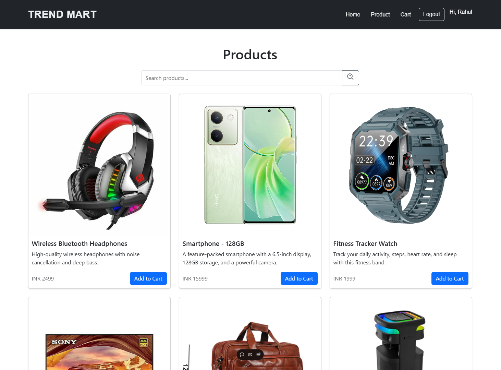

# E-commerce Website

This project is a full-stack E-commerce platform built with modern technologies, enabling users to browse, add items to the cart, and perform transactions seamlessly. The platform includes essential features like user authentication, product management, and an integrated shopping cart system.

---

## Features

### Frontend:
- Built with **React** and **Vite** for fast development and a smooth user experience.
- Responsive design using **CSS** and modern UI libraries.
- User authentication (login, logout, and registration).
- Product listing, search, and categorization.
- Shopping cart system with real-time updates.

### Backend:
- Developed with **Express.js**, ensuring scalability and fast API responses.
- **MongoDB** for database management, storing user, product, and order information.
- JWT-based authentication for secure user sessions.
- RESTful APIs for frontend-backend communication.

### Deployment:
- Frontend hosted on **Vercel** for high availability and performance.
- Backend hosted on **Render**, providing robust server infrastructure.

---

## Installation and Setup

### Prerequisites:
- **Node.js** and **npm** installed.
- MongoDB instance (local or cloud-based).

### Clone Repository
```bash
git clone https://github.com/username/ecommerce-project.git
cd ecommerce-project
```

### Install Dependencies
#### Frontend:
```bash
cd frontend
npm install
```
#### Backend:
```bash
cd backend
npm install
```

### Environment Variables
Create a `.env` file in the `backend` directory with the following:
```env
PORT=5000
MONGO_URI=your_mongodb_connection_string
JWT_SECRET=your_secret_key
```

### Run the Project
#### Backend:
```bash
cd backend
npm run dev
```
#### Frontend:
```bash
cd frontend
npm run dev
```

---

## Deployment

### Frontend:
1. Build the frontend:
   ```bash
   npm run build
   ```
2. Deploy the `dist` folder to **Vercel**.

### Backend:
1. Push the backend to a repository (e.g., GitHub).
2. Link the repository to **Render**.
3. Add environment variables on Render's dashboard.

---

## Usage

### User Features:
- Register and log in.
- Browse and search for products.
- Add and remove items from the shopping cart.
- View and place orders.

### Admin Features:
- Manage product inventory.
- View user orders.
- Monitor system analytics (optional).

---

## Tech Stack

- **Frontend:** React, Vite, CSS, Axios
- **Backend:** Node.js, Express.js
- **Database:** MongoDB
- **Authentication:** JSON Web Tokens (JWT)
- **Deployment:** Vercel (frontend), Render (backend)

---

## Folder Structure
```
project/
├── frontend/
│   ├── public/
│   ├── src/
│   ├── package.json
│   └── vite.config.js
├── backend/
│   ├── controllers/
│   ├── models/
│   ├── routes/
│   ├── utils/
│   ├── .env
│   └── server.js
├── README.md
```

---

## Contributing
Contributions are welcome! Please fork the repository and submit a pull request.

---

## License
This project is licensed under the MIT License. See the LICENSE file for details.

---

## Screenshots
Include screenshots of the application to provide a visual overview. Place the images in a `screenshots` directory and reference them here.

### Example:
#### Homepage:


#### Product Page:


#### Shopping Cart:


#### Admin Dashboard:


